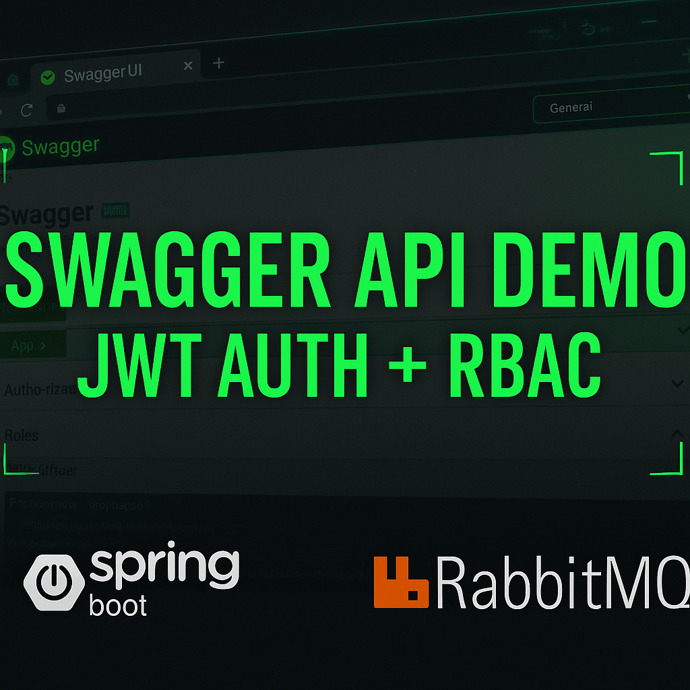
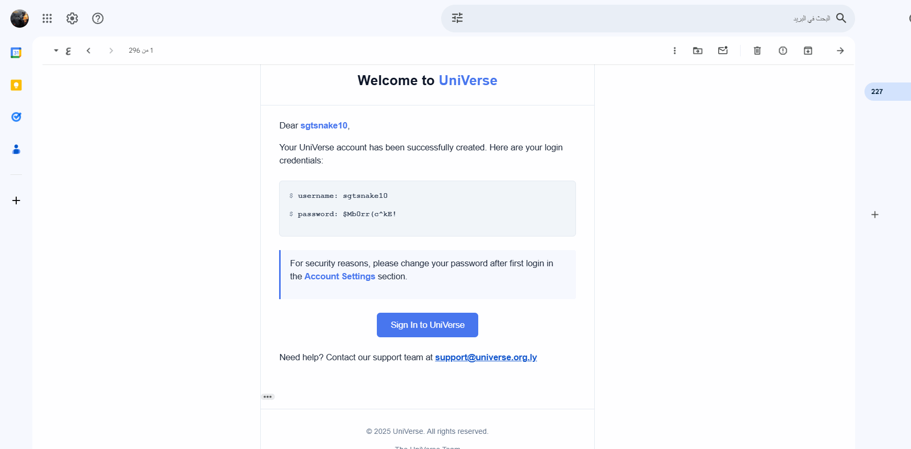
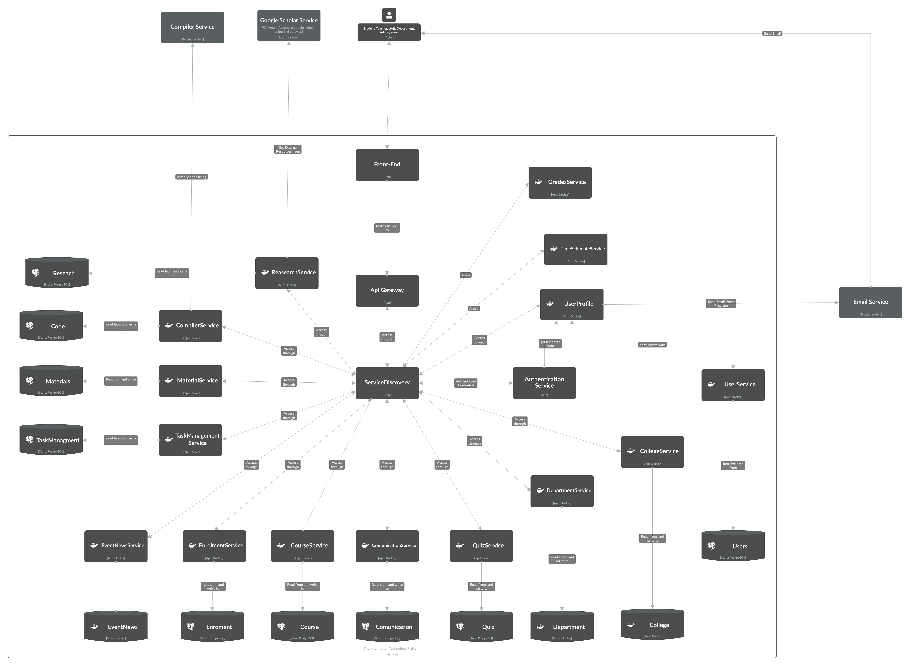

# 🎓 Universe System — Academic Platform Showcase (Closed Source)

> A modular, secure, and offline-first platform built for universities and academic institutions.  
> **Developed and tested at the University of Benghazi, Libya enviroment**.  
> This is a **showcase only** — source code is private to protect sensitive data and for future commercial potential.

---

## 🧠 What is Universe?

Universe is a full academic automation platform that streamlines everything from enrollment to GPA analytics and real-time event tracking. It was developed over **2 years** as a graduation project and is now being used by the University of Benghazi.

It replaces fragmented systems (Google Classroom, WhatsApp, paper forms) with one powerful ecosystem — designed to work even **offline** and hosted fully **within national borders** 🇱🇾.

---

## 🎥 Showcase Videos (2x Speed)

| 🎬 Topic               | 🎞️ Watch Here | 📌 What You'll See                                |
|------------------------|----------------|---------------------------------------------------|
| 🧪 Swagger API Demo    |  | Real-time API testing, JWT auth, RBAC             |
| 🧠 Architecture Overview |  | C4 architecture, service layers, async flow        |

> ⚠️ *Videos are in 2x speed for fast demo. You can slow them down on YouTube if needed.*

---

## 🖼️ Screenshots

---

## 📖 System Summary

📄 [Read the Full System PDF Summary](docs/universe-system-summary.pdf)

---

## 🚀 Features at a Glance

| Area                     | Highlights                                                                 |
|--------------------------|---------------------------------------------------------------------------|
| 🔐 Security              | JWT, RBAC, Redis blacklist, role-based access layers                      |
| 🌍 Offline-first LMS     | Supports low-connectivity areas with persistent caching                   |
| 🧩 Microservices         | 12 services, API Gateway, Eureka, RabbitMQ, Redis                          |
| 📈 Real-time Analytics   | GPA tracking, event timelines, course stats                               |
| 👩‍🏫 Role-Based Access   | Teachers, students, admins, advisors, researchers                          |
| 🇱🇾 Data Sovereignty     | 100% hosted on Libyan infrastructure, compliant with national policy       |

---

## 🛠️ Technical Stack

- **Backend:** Java (Spring Boot), JWT, Redis, PostgreSQL  
- **Frontend:** React, TailwindCSS  
- **Infrastructure:** Docker, Eureka Service Discovery, RabbitMQ  
- **Security:** Refresh tokens, blacklisting, encryption  
- **Deployment:** Linux-based self-hosted, air-gapped optional mode

---

## 🧭 Architecture Overview

> The system is built using the **C4 model** with full separation between services and domains.

---

## 📄 Summary

- 🧠 Developed over 2 years as a graduation project  
- 🏛️ Deployed at University of Benghazi  
- 🔐 Closed-source for data protection & monetization opportunities  
- 🌍 Designed to reduce foreign dependence and support education in Libya  

---

## 👤 Author

**Abdulqadir Aldhalia**  
Computer Science Graduate | Software Engineer | Compatitive programming & Robotics Champion  
📫 [abdulqadir.aldhalia@hotmail.com](mailto:abdulqadir.aldhalia@hotmail.com)  
🔗 [GitHub](https://github.com/Abdulqadir-Aldhalia)

---

## ❗ Disclaimer

This is a **showcase repository only**.  
The source code is **closed** due to privacy, security, and future commercialization.

---
