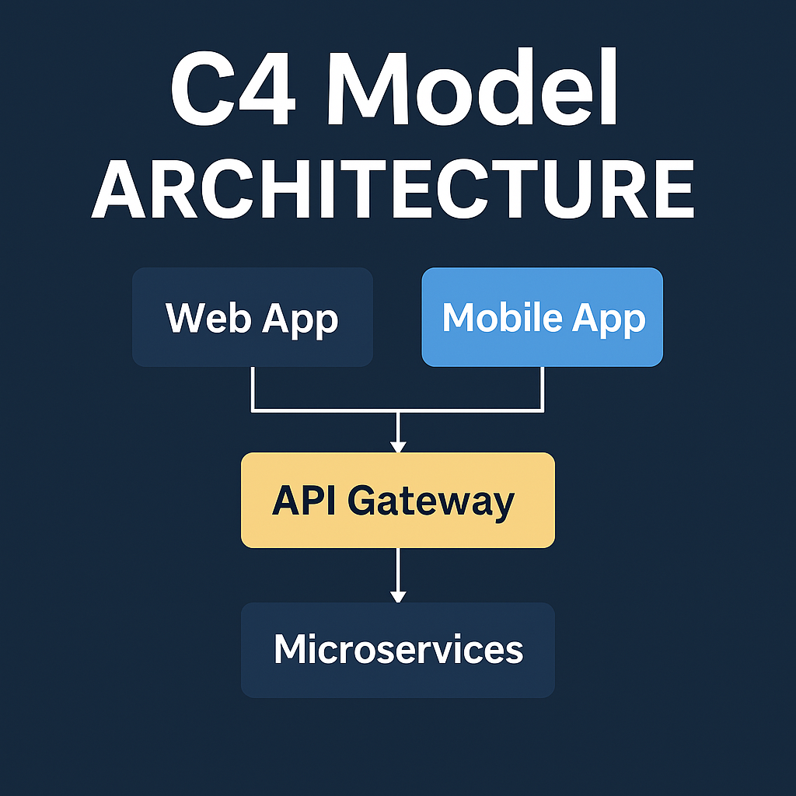

# 

  

  

# Universe System — Academic Platform Showcase  

**📌 TL;DR:** A Dockerized, microservices-based academic platform built for security, offline-first access, and global adaptability.

> A modular, secure, and offline-first platform built for universities and academic institutions worldwide.  
> **Showcase repository**—source code is private to protect sensitive data and future commercial potential.

## 🧭 Table of Contents

1. [🌌 What Is Universe?](#what-is-universe)
2. [🔑 Key Features And Capabilities](#key-features-and-capabilities)
3. [🌍 Who Can Use Universe?](#who-can-use-universe)
4. [🎥 Showcase Videos](#showcase-videos)
5. [📸 Screenshots](#screenshots)
6. [📄 System Summary](#system-summary)
7. [🔍 Features At A Glance](#features-at-a-glance)
8. [🛠️ Technical Stack](#technical-stack)
9. [🏗️ Architecture Overview](#architecture-overview)
10. [📝 Summary](#summary)
11. [👤 Author](#author)
12. [👥 Collaborators](#collaborators)
13. [⚠️ Disclaimer](#disclaimer)

## 🌌 What Is Universe?

**Universe** is a secure, scalable, and fully modular academic platform designed for universities and academic institutions of all sizes. It unifies fragmented academic workflows, eliminates the need for insecure third-party tools (such as **Google Classroom**, **WhatsApp**, **Telegram**, **Facebook Groups**, and **Google Forms**), and delivers a resilient, institution-owned ecosystem tailored for modern educational environments.

Originally developed and tested in the Faculty of Information Technology at the **University of Benghazi**, Universe is fully generic and adaptable—ready for deployment at **any academic institution worldwide** with minimal customization.

Built on a **microservices architecture** using **Spring Boot**, **Docker**, **PostgreSQL**, and **RabbitMQ**, Universe provides robust service separation, faculty-level customization, and scalable deployment options through containerization and service discovery.

## 🔑 Key Features And Capabilities

- **Microservices Architecture** 🧩  
  Built using Spring Boot and Docker with a clean separation of concerns and independent deployability.

- **API Gateway** 🔌  
  For centralized routing, JWT validation, load balancing, and DNS filtering.

- **Robust Security Infrastructure** 🛡️  
  - JWT-based authentication with 24h expiration and Redis token revocation  
  - Role-Based Access Control (RBAC)  
  - PSK-based internal service validation  
  - Post-quantum-aware security planning

- **Offline-First And Resilient** 🌐 
  Supports low-connectivity regions and disaster recovery via redundant local data centers.

- **Custom LMS & Public Portal** 🎓 
  Fully replaces third-party tools with:  
  1. A Learning Management System  
  2. A Notification Hub  
  3. An External Platform for public users and applicants

- **Service Modules Include:** 🛠️  
  - `AuthenticationService`  
  - `CourseService`  
  - `GradesService`  
  - `EnrollmentService`  
  - `DepartmentService`  
  - `CollegeService`  
  - `UserProfileService`  
  - `TimeScheduleService`  
  - `EventNewsService`

- **Automated Academic Workflows** ⚙️  
  Handles GPA calculation, semester transitions, prerequisite checks, waitlisting, and dashboard generation.

- **C4-Modeled System Design** 📐 
  Complete architecture modeled via the C4 model (context, container, component, and class).

- **User-Centric Interfaces** 🎨 
  Role-specific dashboards for students, teachers, admins, departments, and public visitors—all built with accessibility (WCAG) and responsiveness in mind.

- **Government-Ready Deployment** 🏛️  
  Fully compliant with Libya’s **National Education Strategy 2030**, but modular and customizable for global use.

## 🌍 Who Can Use Universe?

While Universe was initially developed to address academic and sovereignty challenges in Libyan universities, its architecture is **completely generic**. It can be deployed in:

- Public and private universities  
- Colleges and research institutes  
- Vocational and technical education centers  
- Ministries of education or national platforms

With configurable modules, customizable UI/UX, and institution-specific role control, **Universe adapts to your ecosystem**, not the other way around.

## 🎥 Showcase Videos (2× Speed)

| 🎬 Topic                | 🎞️ Watch Here                                                                                                                                     | 📌 What You’ll See                                |
|-------------------------|---------------------------------------------------------------------------------------------------------------------------------------------------|---------------------------------------------------|
| 🧪 Swagger API Demo     |                                     | Real-time API testing, JWT auth, RBAC             |
| 🧠 Architecture Overview|             | C4 architecture, service layers, async flow       |

> ⚠️ *Videos are in 2× speed for fast demo. Slow down in YouTube settings as needed.*

## 📸 Screenshots

## 📄 System Summary

📄 [Read the Full System PDF Summary](docs/universe-system-summary.pdf)

## 🔍 Features At A Glance

| Area                   | Highlights                                                                 |
|------------------------|----------------------------------------------------------------------------|
| 🔐 Security            | JWT, RBAC, Redis blacklist, role-based access layers                       |
| 🌍 Offline-First LMS   | Supports low-connectivity areas with persistent caching                    |
| 🧩 Microservices       | 12 services, API Gateway, Eureka, RabbitMQ, Redis                          |
| 📈 Real-Time Analytics | GPA tracking, event timelines, course stats                                |
| 👩‍🏫 Role-Based Access | Teachers, students, admins, advisors, researchers                          |
| 🇱🇾 Data Sovereignty   | 100% hosted on Libyan infrastructure, compliant with national policy        |

## 🛠️ Technical Stack

- **Backend:** Java (Spring Boot), JWT, Redis, PostgreSQL  
- **Frontend:** React, Material UI  
- **Infrastructure:** Docker, Eureka Service Discovery, RabbitMQ  
- **Security:** Refresh tokens, blacklisting, encryption  
- **Deployment:** Linux-based self-hosted, air-gapped optional mode

## 🏗️ Architecture Overview

> The system is built using the **C4 model** with full separation between services and domains.

## 📝 Summary

- 🧠 Developed over 2 years as a graduation project  
- 🏛️ Deployed at the University of Benghazi  
- 🔒 Closed-source for data protection & commercialization potential  
- 🌍 Designed to reduce foreign dependence and support education globally

## 👤 Author

**Abdulqadir Aldhalia**  
Computer Science Graduate | Software Engineer | Competitive Programming & Robotics Enthusiast  
📫 [abdulqadir.aldhalia@hotmail.com](mailto:abdulqadir.aldhalia@hotmail.com)  
🔗 [GitHub](https://github.com/Abdulqadir-Aldhalia)

## 👥 Collaborators

**Abdulla Kamal**  
Front-end Developer for the Universe System. Be sure to check out his profile:  
🔗 [GitHub](https://github.com/Abdulla-kamal)

## ⚠️ Disclaimer

This is a **showcase repository only**; the source code is **closed** due to privacy, security, and future commercialization.
The UI is not final and for **testing purposes and showcase**, the features might be **extended**.

